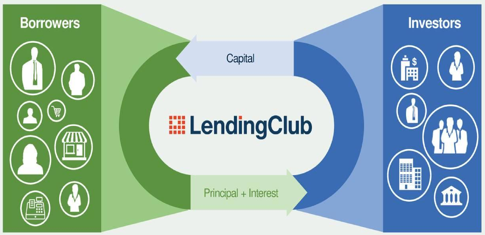
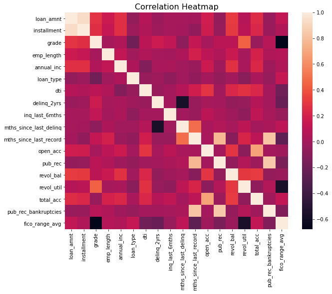
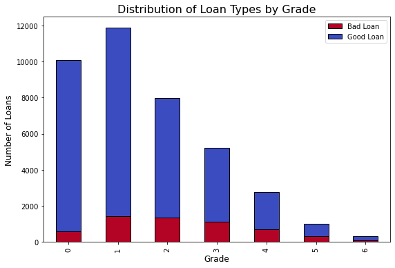
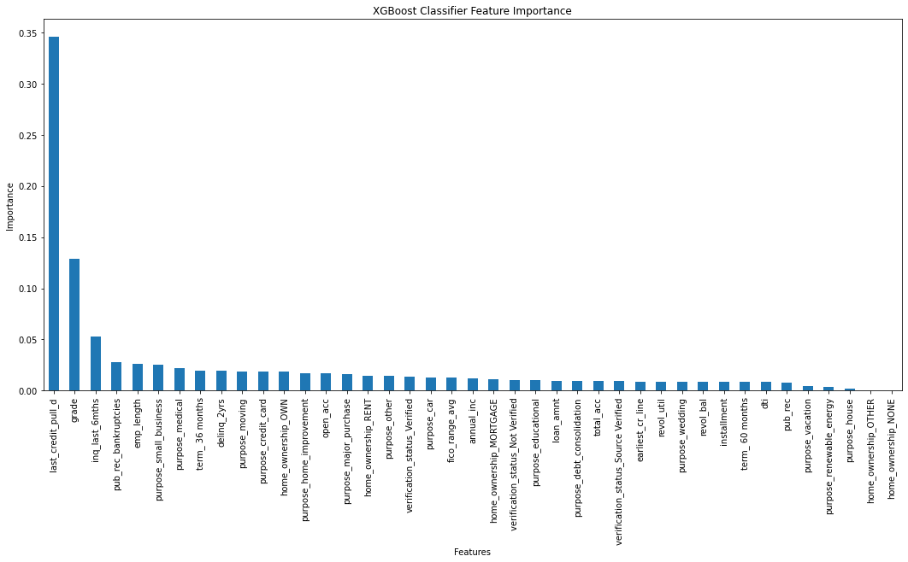

# Lending Club Loan Approval Optimization
Lending Club is one of the world's largest peer-to-peer lending platform for personal loans.
Its business operation is undermined by the inclusion of delinquent borrowers and the exclusion of responsible borrowers, misrepresented in the loan approval process.
While it is impossible to develop a completely foolproof screening system, utilizing a systematic, data-driven machine learning model will significantly improve the screening process.

## I. Data
The dataset pertaining to 2007-2011 has been acquired from https://data.world/jaypeedevlin/lending-club-loan-data-2007-11.

## II. Data Wrangling
[Data Wrangling Report](https://github.com/Michael-J-Son/Lending_Club_Capstone/blob/main/data_wrangling/Lending_Club_Data_Wrangling.ipynb)

__1) Data Cleaning__
 * All columns entirely comprised of missing values have been eliminated from the working data.

__2) Feature Selection__
 * Features have been evaluated and selected based on: redundancy, relevance, data leakage, usefulness.
 * Any unnecessary features have been removed from the working data.
 
__3) Feature Modification__
 * Average FICO range of borrower have been derived from upper and lower boundary FICO range of borrower.
 * Target feature (loan_status) has been converted to a binary classification feature.

__4) Target Feature Visualization__
 * It is evident from the pie chart that the given data is imbalanced data.

## III. Exploratory Data Analysis
[Exploratory Data Analysis Report](https://github.com/Michael-J-Son/Lending_Club_Capstone/blob/main/exploratory_data_analysis/Lending_Club_EDA.ipynb)

__1) Object Feature Conversion__
 * Object features containing numerical or ordinal values have been converted to numerical features.

__2) Feature Correlations__
 * It is rather difficult to ascribe much significance to most of these correlations, since their high values are attributable to features which are intrinsically closely associated with each other.

__Notable Loan Type Correlations:__
 * grade
 * fico_range_avg
 * revol_util
 * inq_last_6mths

Bad loans appear to be relatively high among grade 1, 2, and 3.
Ideally, the number of bad loans should be increasing with declining grade, considering lower grades being equivalent to better grades.

## IV. Preprocessing
[Preprocessing Report](https://github.com/Michael-J-Son/Lending_Club_Capstone/blob/main/preprocessing/Lending_Club_Preprocessing.ipynb)

__1) Data Processing__
 * Features containing datetime information have been converted into datetime objects, and nominal features have been one-hot encoded.

## V. Modeling
[Modeling Notebook](https://github.com/Michael-J-Son/Lending_Club_Capstone/blob/main/modeling/Lending_Club_Modeling.ipynb)

__1) Train Test Split__

__2) Standardization of Features__
 * Standardized features using StandardScaler

__3) Resampling__
 * SMOTE from imbalanced-learn library has been used to oversample the minority class of the training data to resolve the issue of imbalanced data.

__4) Model Evaluation__
 * Hyperparameter tuning with Randomized Search.
 * F1 score and ROC AUC score were preferred over accuracy as evaluation metrics because this project is an imbalanced classification problem.
 * Best Model: XGBoost, based on the performance evaluation in this project.

__Models Tested:__
 * Logistic Regression
 * Random Forest
 * Support Vector Machine
 * XGBoost

__Features of Importance__

