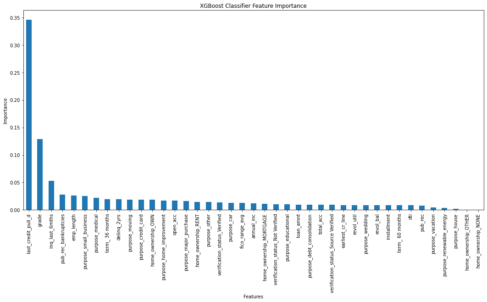

# Lending Club Loan Approval Optimization
Lending Club is one of the world's largest peer-to-peer lending platform for personal loans.
Its business operation is undermined by the inclusion of delinquent borrowers and the exclusion of responsible borrowers, misrepresented in the loan approval process.
While it is impossible to develop a completely foolproof screening system, utilizing a systematic, data-driven machine learning model will significantly improve the screening process.

## Data
 * Source: https://data.world/jaypeedevlin/lending-club-loan-data-2007-11
 * **42,538** entries, **115** features

## Data Wrangling/Feature Engineering
[Data Wrangling Report](https://github.com/Michael-J-Son/Lending_Club_Capstone/blob/main/data_wrangling/Lending_Club_Data_Wrangling.ipynb)

 1. Data Cleaning

    * Removed empty columns/null values.
 2. Feature Selection

    * Eliminated redundancy/data leakage.
    * Retained relevant/useful features.
 3. Features Converted to Numerical Data Type

    * Feature containing numerical values

      * **revol_util**: revolving line utilization rate.
    * Features containing ordinal values

      * **grade**: loan grade assigned by Lending Club.
      * **emp_length**: employment length in years.
 4. Newly Added Feature

    * **fico_range_avg**: mean value of **fico_range_low** and **fico_range_high**.
 5. Target Feature Engineering

    * Excluded loans in-progress.
    * Target feature reclassified into two groups, then binarized.
      * **1** (Good Loan): Fully Paid
      * **0** (Bad Loan): Charged Off, Does Not Meet the Credit Policy

## Exploratory Data Analysis
[Exploratory Data Analysis Report](https://github.com/Michael-J-Son/Lending_Club_Capstone/blob/main/exploratory_data_analysis/Lending_Club_EDA.ipynb)

### Pearson Correlations

 * Notable **loan_type** correlations 

   * **grade**: loan grade assigned by Lending Club.
   * **fico_range_avg**: mean value of **fico_range_low** and **fico_range_high**.
   * **revol_util**: revolving line utilization rate.
   * **inq_last_6mths**: the number of inquiries in past 6 months (excluding auto and mortgage inquiries).

### Term/Loan Amount

 * Loan amount tends to increase with longer term regardless of loan type.

### Influence of Applicant Location

 * States with highest # of good loans ≈ States with highest # of bad loans
 * Applicant location (state) is not a good predictor for loan type.

### Loan Type Distribution

 * Grade description: 0 as worst, 6 as best
 * Ideally, the number of bad loans should decrease with higher grade.

## Preprocessing
[Preprocessing Report](https://github.com/Michael-J-Son/Lending_Club_Capstone/blob/main/preprocessing/Lending_Club_Preprocessing.ipynb)

 * Features containing datetime information have been converted to datetime objects.
 * Nominal features have been one-hot encoded.

## Modeling
[Modeling Notebook](https://github.com/Michael-J-Son/Lending_Club_Capstone/blob/main/modeling/Lending_Club_Modeling.ipynb)

### Overview

 * Nature of task

   * Supervised learning
   * Binary classification of highly imbalanced data
 * Machine learning tools used

   * **Scikit-Learn**
   * **Imbalanced-Learn**
   * **XGBoost**

### Procedure

I. Data Preprocessing

 1. Training/Test split (**80%**: **20%**)
 2. Standardization of features with **StandardScaler**
 3. Minority class (Bad Loan) oversampling with **SMOTE** from **Imbalanced-Learn**

II. Hyperparameter Tuning with Randomized Search

 * **Stratified K-Fold** with **cv = 5**
 * **n_iter = 30**
 * **scoring = 'roc_auc'**

III. Training with Tuned Hyperparameters

IV. Performance Evaluation

 * Evaluation metric

   * **F1 scores**
   * **ROC AUC**
 * Models trained and evaluated

   * **Logistic Regression**
   * **Random Forest**
   * **Support Vector Machine**
   * **eXtreme Gradient Boosting**

### Model Comparison

| Model                     | Minority F1 | Majority F1 | ROC AUC | Accuracy |
| ------------------------- | ----------- | ----------- | ------- | -------- |
| Logistic Regression       | 0.47        | 0.80        | 0.78    | 0.71     |
| Random Forest             | 0.53        | 0.91        | 0.74    | 0.85     |
| Support Vector Machine    | 0.41        | 0.87        | 0.67    | 0.79     |
| eXtreme Gradient Boosting | 0.56        | 0.89        | 0.80    | 0.83     |

 * Best model: **eXtreme Gradient Boosting**

### Features of Importance

 * Primary features of importance

   * **last_credit_pull_d**: the most recent month in which Lending Club pulled credit for this loan.
   * **grade**: loan grade assigned by Lending Club.
   * **inq_last_6mths**: the number of inquiries in past 6 months (excluding auto and mortgage inquiries).

## Assumptions/Limitations

 * Assumption

   * Data collected from loan applicants is genuine.
 * Limitations

   * Outdated data.
   * Large volume of missing features (only 24 out of 115 features usable).
   * Limited sample size (only 39,239 entries used).

## Conclusion

 * Best model: **eXtreme Gradient Boosting**
 * Primary features of importance: **last_credit_pull_d**, **grade**, **inq_last_6mths**
 * Prospective improvements

   * Up-to-date dataset
   * Hyperparameter tuning with different techniques
   * Alternative classifier algorithms: **Neural Network**, **Deep Learning**, etc.
